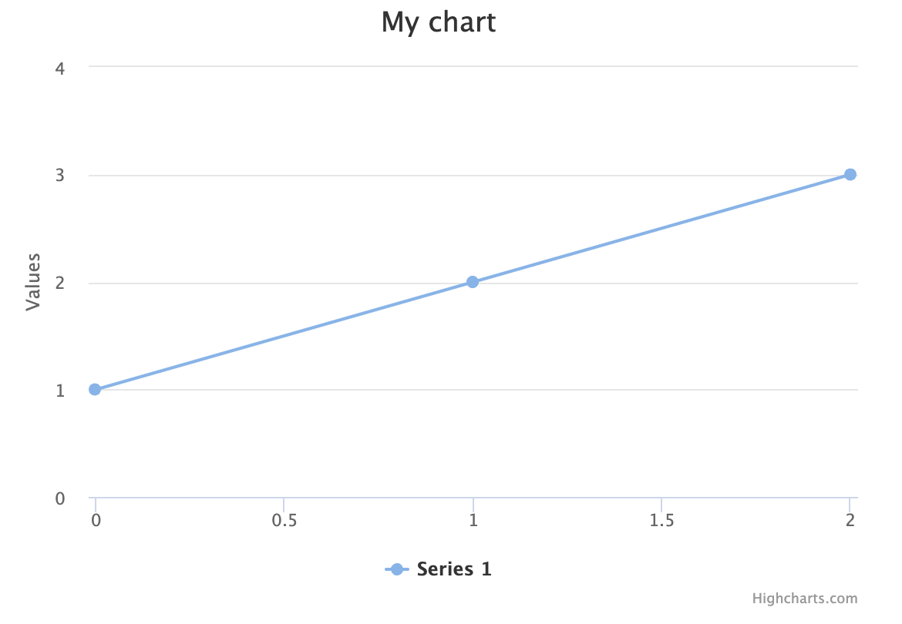

# Highcharts

[Highcharts](https://www.highcharts.com/) is a charting library with official React support, that helps visualize data.

### Setup

Install Highcharts by including it in your `package.json` with both `"highcharts"` and `"highcharts-react-official"`.

Once installed, make a new file for your Highcharts react component, and import Highcharts:

```
import React from 'react'
import { createRoot } from "react-dom/client"
import Highcharts from 'highcharts'
import HighchartsReact from 'highcharts-react-official'

function SampleChart({ props }) {
    const options = {
        title: {
            text: 'My chart'
        },
        series: [{
            data: [1, 2, 3]
        }]
    }

    return <HighchartsReact highcharts={Highcharts} options={options} />
}  

const container = window.reactSampleMount
const root = createRoot(container)
root.render(<SampleChart props={window.props} />)
```

Then within your django template, set up a `div` for your chart where the id matches the name of the component:

```
<div id="SampleChart"">
    <div class="text-center">
        <i class="fa fa-lg fa-spinner fa-spin"></i><br><br>
        <i class="pending">Loading chart...</i><br><br>
    </div>
</div>
```

And add the appropriate scripts to this same template where `window.<reactMountName>` matches the value of the container in the component, and is using the `div` we just set up:

```
<script type="text/javascript">
    window.props = JSON.parse(document.getElementById('props').textContent)
    window.reactSampleMount = document.getElementById('SampleChart')
</script>


    <script type="text/jsx" src=""></script>

```

And now you should have a basic chart up and running! :clap::clap::clap:


### Adding Data

A chart's no good without the data you're trying to show. You can have as many series as you like, and to add your data points to each, simply add them to the series:

```
const options = {
    title: {
        text: 'My chart'
    },
    series: [
        {
            name: 'First Series',
            color: '#FF0000',
            data: [
                props.point1,
                props.point2,
                props.point3
            ]
        },
        {
            name: 'Second Series',
            color: '#0000FF',
            data: [
                props.point4,
                props.point5,
                props.point6
            ]
        }
    ]
}
```

### Customization

From here you can follow the [Highcharts api docs](https://api.highcharts.com/highcharts/) to modify your chart. Here are some modifications you can make:

[Change the type of chart](https://api.highcharts.com/highcharts/chart.type)

```
const options = {
    title: {
        text: 'My chart'
    },
    chart: {
        type: 'column'
    }
}
```

[Title](https://api.highcharts.com/highcharts/xAxis.title.text) and [categorize](https://api.highcharts.com/highcharts/xAxis.categories) the axes
```
title: {
    text: '# of People Who Prefer Each Color'
},
xAxis: {
    categories: [
        "Red",
        "Blue",
        "Yellow",
        "Green"
    ],
    title: {
        text: "Colors",
        style: {
            fontSize: 11,
        },
    },
},
```

[Format the tooltip that shows on hover](https://api.highcharts.com/highcharts/tooltip.formatter)
```
title: {
    text: '# of People Who Prefer Each Color'
},
tooltip: {
    formatter: function() {
        return 'The value for <b>' + this.x + 
            '</b> is <b>' + this.y + '</b>'
    }
}
```

[Display amounts for each point on the chart (with dataLabels)](https://api.highcharts.com/highcharts/plotOptions.series.dataLabels)
```
title: {
    text: '# of People Who Prefer Each Color'
},
plotOptions: {
    series: {
        dataLabels: {
            enabled: true
        }
    }
},
```

[Disable credits](https://api.highcharts.com/highcharts/credits.enabled)
```
title: {
    text: '# of People Who Prefer Each Color'
},
credits: {
    enabled: false
}
```

### Accessibility

Highcharts has an accessibility module that introduces the feature to navigate through your charts with the keyboard, as well as give context about your chart to screen readers.

[Their accessibility docs](https://www.highcharts.com/docs/accessibility/accessibility-module) describe how to include it with a script. If you're using a react component however, you'll have to import the module into that instead, and then initialize it
```
import React from "react"
import { createRoot } from "react-dom/client"
import Highcharts from "highcharts"
import highchartsAccessibility from "highcharts/modules/accessibility"  # Importing
import HighchartsReact from "highcharts-react-official"

highchartsAccessibility(Highcharts)  # Initializing

function SampleChart({ props }) {
    ...
```
