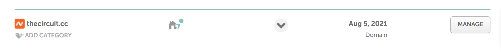
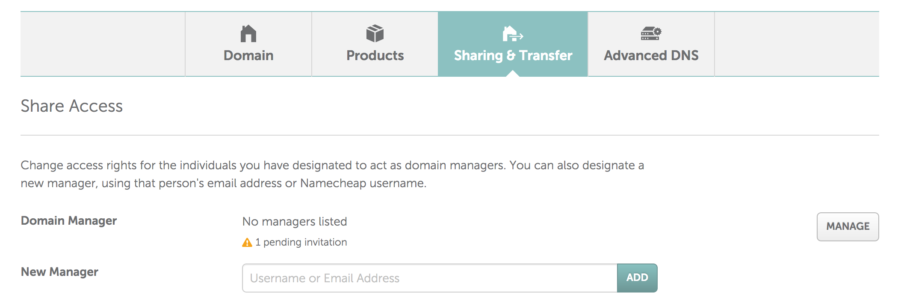

# Domain names

DataMade uses [Namecheap](https://www.namecheap.com/) as our domain name
provider. Currently, domain names we control are under Derek's personal account.

If we are setting up a domain name, Derek should purchase the domain name. After
purchase, Derek will share administrative privileges for the domain name with
all partners and lead developers.

## Sharing administrative privileges for a domain

1. In the listing of domain names, click manage for the domain
name you want to share privileges on.

    

2. Choose the "Sharing & Transfer" tab.

    

3. Add the user to the account using their `@datamade.us` email address and
submit.

4. Give the user full permissions.

    
