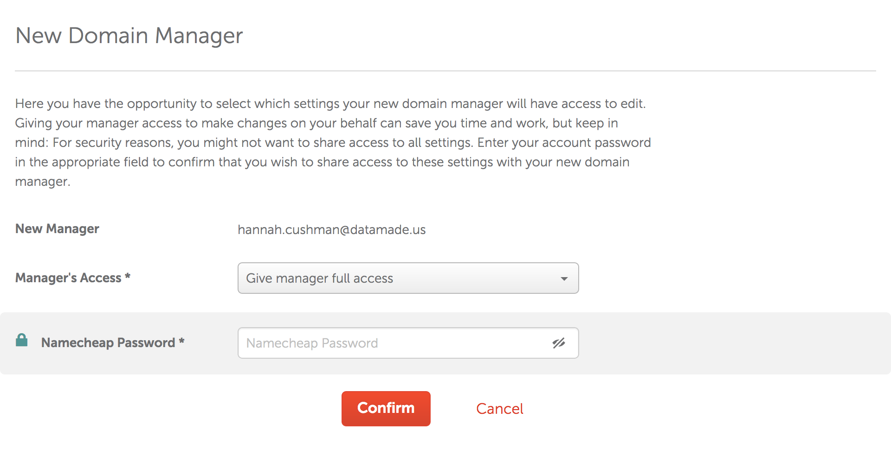

DataMade uses namecheap.com as our domain name provider.

If we are setting up a domain name, Derek Eder should purchase the domain name. Currently, we the DataMade domain names are under his personal account.

After purchase, Derek will share administrative privileges for the domain name with all partners and lead developers.

1. In the listing of domain names, click manage for the domain
name you want to share privileges on.

2. Choose the Sharing and Transfer tab

3. Add the user to the account using their datamade address and submit

4. Give them full permissions

