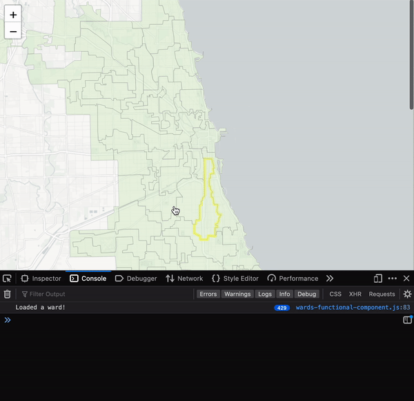
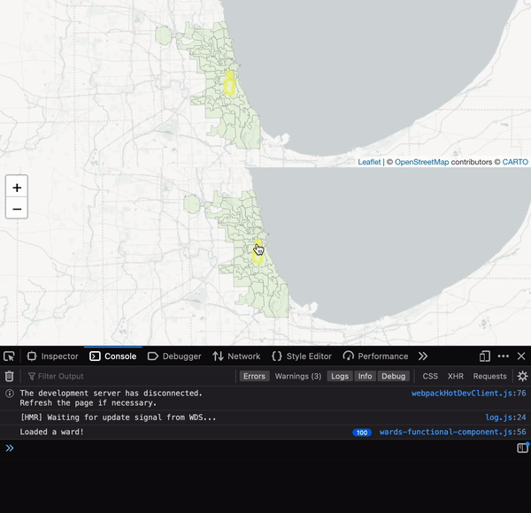

# React Leaflet how-to
`react-leaflet` is an abstraction of LeafletJS for React. It provides React components for building Leaflet maps, with React props that allow you to pass any of the Leaflet options as props.

## Examples
- If you need a straightforward implementation, checkout the [LISC Chicago Neighborhood Development Awardees map](https://github.com/datamade/lisc-cnda-map/blob/master/app/src/components/map.js)
- [The introduction section for `react-leaflet`](https://react-leaflet.js.org/docs/start-introduction)

## react-leaflet guide
This guide will walk you through how to use React Leaflet to make an interactive map with GeoJSON. You will first make a basic map, then add GeoJSON fetching, then attach click events to each GeoJSON feature. Each feature will be clickable and render data to the UI about the clicked feature. In other words, you'll make a map where you can click on a Chicago Judicial Ward, and information about that ward will show up on the page.

This guide also shows one of several ways to compose reusable components in a React app. Hopefully, if this guide succeeds at that, then you should be able to take these lessons and apply them to your project, i.e. organize your components in a way that works for your project or makes more sense to your brain.

Before you begin, you should read [the introduction section for `react-leaflet`](https://react-leaflet.js.org/docs/start-introduction).

Check out the full code for this guide here: https://github.com/smcalilly/hello-leaflet.

## Setup your React app
Assuming you have npm installed:
```bash
npx create-react-app hello-leaflet
cd hello-leaflet
```

Install `leaflet@1.7.1`, `react-leaflet@3.1.0`, and `@react-leaflet/core@1.0.2`:
```bash
npm install leaflet@1.7.1 react-leaflet@3.1.0 @react-leaflet/core@1.0.2
```
These versions are important due to an incompatibility with `react-leaflet/core` and `create-react-app`, at the time of writing. For more info about that, see this [stackoverflow with a variety of workarounds](https://stackoverflow.com/questions/67552020/how-to-fix-error-failed-to-compile-node-modules-react-leaflet-core-esm-pat), and this [Github issue about the bug](https://github.com/PaulLeCam/react-leaflet/issues/877).


Test that your React app works:
```bash
npm start
```

## Create a Base Map
In `src/maps/base.js`, create this component:
```jsx
import React from 'react'
import { MapContainer, TileLayer } from 'react-leaflet'
import 'leaflet/dist/leaflet.css'

function BaseMap({ center, zoom, className, children }) {
    return (
      <MapContainer
        center={center} 
        zoom={zoom}
        className={className}>
          <TileLayer
            url="https://{s}.basemaps.cartocdn.com/light_nolabels/{z}/{x}/{y}{r}.png"
            attribution='&copy; <a href="https://www.openstreetmap.org/copyright" target="_parent">OpenStreetMap</a> contributors &copy; <a href="https://carto.com/attributions" target="_parent">CARTO</a>'
          />
          {children}
      </MapContainer>
    )
}

export default BaseMap
```

This is a reusable component for making maps. Whenever you use it, you can pass props into it, like `center`, `zoom`, `className`, and `children`. The `children` argument enables you to build a map with custom layers. This is a powerful feature of React, and helps you "compose" resuable components in a way that makes sense for your UI. You will see how this works when you add the GeoJSON layer.

**It's very important that you import `leaflet/dist/leaflet.css` to your `BaseMap`. This isn't obvious from the React Leaflet documentation.** If you don't show this, then the `react-leaflet` library won't have the required CSS, causing the map to render in weird, undesired ways.

### Add the CSS
The `react-leaflet` library creates a [`<div>` element on the DOM](https://react-leaflet.js.org/docs/start-introduction#dom-rendering) when the map is rendered, and it comes with a CSS class named `leaflet-container`. You need to target this class with some height and width properties in order to show the map.

Add to `src/App.css`:
```css
.leaflet-container {
  height: 100%;
  width: 100%;
}

.map-viewer {
  height: 550px;
}
```

`.map-viewer` will target a parent `<div>` in which your map will live. Since `.leaflet-container` will expand the height and width of the parent container, you can use `.map-viewer` to control the sizing on the page.

### Render the BaseMap
At this point, you can import and instantiate a `BaseMap`. Replace the code in `src/App.js` with your map:
```jsx
import './App.css';
import BaseMap from './maps/base'

function App() {
  return (
    <div className="App">
        <div className='map-viewer'>
            <BaseMap center={[41.8781, -87.6298]} zoom={10} />
        </div>
    </div>
  );
}

export default App
```

This should show a map that is centered-ish above Chicago.

## Fetch and render GeoJSON
This is where you'll make a map with some GeoJSON. We'll use the [2012 Chicago Judicial Wards GeoJSON](https://raw.githubusercontent.com/datamade/chicago-judicial-elections/master/wards/wards_2012.geojson).

### Create a new component with the BaseMap
We can use our `BaseMap` component to build a new component for a unique map. We want to create a `ChicagoWardMap` component so that we can encapsulate all the details about the map.

Import the `BaseMap` component in `src/maps/wards.js` and use it in a new `ChicagoWardMap` component:
```jsx
import React, { useEffect, useState } from 'react'
import BaseMap from './base'
import { GeoJSON } from 'react-leaflet'

function ChicagoWardMap() {
    return (
      <BaseMap center={[41.8781, -87.6298]} zoom={10}>
      </BaseMap>
    )
}

export default ChicagoWardMap
```

Refactor the map in `App.js`. Import the `ChicagoWardMap` component into `App.js` and replace the `BaseMap` component:
```jsx
import './App.css'
import ChicagoWardMap from './maps/wards'

function App() {
  return (
    <div className="App">
        <div className='map-viewer'>
            <ChicagoWardMap />
        </div>
    </div>
  );
}

export default App
```

It should look the same as when you were rendering the `BaseMap` there.

### Render the GeoJSON
Now the fun part — fetch and render the GeoJSON. You're going to do all of this in the `ChicagoWardMap` component. In `src/maps/wards.js`:
```jsx
import React, { useEffect, useState } from 'react'
import BaseMap from './base'
import { GeoJSON } from 'react-leaflet'

function ChicagoWardMap() {
  const [wardBorders, setWardBorders] = useState(null)

  useEffect(() => {
    // get the geojson
    fetch('https://raw.githubusercontent.com/datamade/chicago-judicial-elections/master/wards/wards_2012.geojson')
      .then((res) => res.json()) // parse the response into json
      .then((geojson) => {
        setWardBorders(geojson) // with the geojson, set the state for wardBorders
      })
  }, [setWardBorders])

  const fill = {
    fillColor: '#daf0ce', 
    weight: 0.5,
    opacity: 0.4,
    color: '#666',
    fillOpacity: 0.5
  }

  return (
    <BaseMap center={[41.8781, -87.6298]} zoom={10}>
      {/* this will only show when wardBorders has a truthy value */}
      {wardBorders && <GeoJSON
                        key='ward-layer'
                        data={wardBorders}
                        style={fill} />}
    </BaseMap>
  )
}

export default ChicagoWardMap
```

This code:
- Creates getters and setters for the `wardBorder` state:  `const [wardBorders, setWardBorders] = useState(null)`.
- `useEffect` executes when the component renders.
    - It uses `fetch` to retrieve the geojson.
    - Parses the geojson and sets it as the value for `wardBorder`.
- When `wardBorder` has a value, it will be passed into the `GeoJSON` component as `data`. This should show the Chicago Judicial Ward boundaries from 2012.

Note that you don't have to fetch the GeoJSON. You can import the JSON directly from a file in your React app's code. This all depends on your application's architecture. This fetching pattern would allow for more dynamic mapping, like if you wanted a user to toggle between maps and your GeoJSON was retrievable from an API.

## Attach click event callbacks to each GeoJSON feature
Finally, we can attach callbacks to each GeoJSON feature. This is how you can add logic whenever a user clicks on a feature.

Leaflet provides an `onEachFeature` option you can use to assign a callback that runs for each feature you add to your map. See [the Leaflet documentation](https://leafletjs.com/reference.html#geojson-oneachfeature) for more details. `react-leaflet` provides access to this option through the `onEachFeature` prop. First, define your callback inside the scope of the `ChicagoWardMap` component:
```jsx
function eventHandlersOnEachFeature(feature, layer) {
  layer.on({
    click: onWardClick
  })
}
```

Create the `onWardClick` function, also in the scope of `ChicagoWardMap`:
```jsx
function onWardClick(e) {
  const layer = e.target

  const layerFeature = layer?.feature?.properties
                        ? layer.feature.properties 
                        : null
  
  console.log(layerFeature)
}
 ```

To your `GeoJSON` instance, pass in the `eventHandlersOnEachFeature` function as an argument to the `onEachFeature` props:
```jsx
<GeoJSON
  key='ward-layer'
  data={wardBorders}
  style={fill} 
  onEachFeature={eventHandlersOnEachFeature} />
```

Your `src/maps/wards.js` should look like this:
```jsx
import React, { useEffect, useState } from 'react'
import BaseMap from './base'
import { GeoJSON } from 'react-leaflet'

function ChicagoWardMap() {
  const [wardBorders, setWardBorders] = useState(null)

  useEffect(() => {
    // get the geojson
    fetch('https://raw.githubusercontent.com/datamade/chicago-judicial-elections/master/wards/wards_2012.geojson')
      .then((res) => res.json())
      .then((geojson) => {
        setWardBorders(geojson)
      })

  }, [setWardBorders])

  const fill = {
    fillColor: '#daf0ce', 
    weight: 0.5,
    opacity: 0.4,
    color: '#666',
    fillOpacity: 0.5
  }
  
  function onWardClick(e) {
    const layer = e.target

    const layerFeature = layer?.feature?.properties
                          ? layer.feature.properties 
                          : null
    
    console.log(layerFeature)
  }

  function eventHandlersOnEachFeature(feature, layer) {
    layer.on({
      click: onWardClick
    })
  }

  return (
    <div className='map-viewer'>
      <BaseMap center={[41.8781, -87.6298]} zoom={10}>
        {wardBorders && <GeoJSON
                          key='ward-layer'
                          data={wardBorders}
                          style={fill} 
                          onEachFeature={eventHandlersOnEachFeature} />}
      </BaseMap>
    </div>
  )
}

export default ChicagoWardMap
```

Now, whenever you click on a ward in your map, it should print some information in your console.

### Show the ward's information in the UI
Printing to the console isn't very useful. So, we need get that data and render it to the UI. Once we've done that, we'll refactor the component and ["lift state up" to the parent component](https://reactjs.org/docs/lifting-state-up.html), so that we can keep the logic for a `ChicagoWardMap` separated from the logic of what you want on other parts of the UI.

Create a new hook in the `ChicagoWardMap` component called `ward`:
```jsx
const [ward, setWard] = useState(null)
```

If you don't know what a React Hook is, then you can learn about it [from the React docs](https://reactjs.org/docs/hooks-intro.html). It's a powerful API for managing the state of your React components.

Use the `setWard` function in your `onWardClick` function:
```jsx
function onWardClick(e) {
  const layer = e.target

  const layerFeature = layer?.feature?.properties
                        ? layer.feature.properties 
                        : null

  setWard(layerFeature)
}
```

You can now use that GeoJSON feature in your UI. Add some html to your `ChicagoWardMap` that shows the clicked object. Your `ChicagoWardMap` should look like this:
```jsx
import React, { useEffect, useState } from 'react'
import BaseMap from './base'
import { GeoJSON } from 'react-leaflet'

function ChicagoWardMap() {
  const [wardBorders, setWardBorders] = useState(null)
  const [ward, setWard] = useState(null)

  useEffect(() => {
    // get the geojson
    fetch('https://raw.githubusercontent.com/datamade/chicago-judicial-elections/master/wards/wards_2012.geojson')
      .then((res) => res.json()) // parse the response into json
      .then((geojson) => {
          setWardBorders(geojson) // with the geojson, set the state for wardBorders
      })
  }, [setWardBorders])

  const fill = {
    fillColor: '#daf0ce', 
    weight: 0.5,
    opacity: 0.4,
    color: '#666',
    fillOpacity: 0.5
  }

  function onWardClick(e) {
    const layer = e.target

    const layerFeature = layer?.feature?.properties
                          ? layer.feature.properties 
                          : null
    
    setWard(layerFeature)
  }

  function eventHandlersOnEachFeature(feature, layer) {
    layer.on({
      click: onWardClick
    })
  }

  return (
    <>
      <BaseMap center={[41.8781, -87.6298]} zoom={10}>
        {/* this will only show when wardBorders has a value */}
        {wardBorders && <GeoJSON
                          key='ward-layer'
                          data={wardBorders}
                          style={fill} 
                          onEachFeature={eventHandlersOnEachFeature} />}
      </BaseMap>
      {ward && <p>Ward {ward.ward}'s shape_area = {ward.shape_area} and shape_leng = {ward.shape_leng}</p>}
    </>
  )
}

export default ChicagoWardMap
```

Nice!

### Lift state up
One thing I don't like about the current design of the `ChicagoWardMap`: what if you need to use the ward's information elsewhere in the UI, in a place that is outside of this component? You would need to "lift state up" and set the `ward` state in a parent component. This is a common pattern in React applications, and can be difficult to understand if you're not familiar with it. It's simply a JavaScript callback that passes a message from a child component to a parent component.

In your `App.js`, import the `useState` hook from React, create a `ward` state object, and render it on the page like you did in `ChicagoWardMap`:
```jsx
import { useState } from 'react'
import './App.css'
import ChicagoWardMap from './maps/wards'

function App() {
  const [ward, setWard] = useState(null)

  return (
    <div className="App">
      <div className='map-viewer'>
        <ChicagoWardMap 
          onSelectWard={setWard}
        />
        {ward && <p>Ward {ward.ward}'s shape_area = {ward.shape_area} and shape_leng = {ward.shape_leng}</p>}
      </div>
    </div>
  );
}

export default App
```

This code does what `ChicagoWardMap` did, but it depends on the `onSelectWard` prop to do this. So, we need to add that prop to the `ChicagoWardMap` component. Where you declare the `ChicagoWardMap` function, pass in `onSelectWard` as a prop:
```jsx
function ChicagoWardMap({ onSelectWard }) {...}
```

Remove these two lines of code, since you replaced them in `App.js`:
- `const [ward, setWard] = useState(null)`
- `{ward && <p>Ward {ward.ward}'s shape_area = {ward.shape_area} and shape_leng = {ward.shape_leng}</p>}`

And in the `onWardClick` function, replace the `setWard` function with `onChooseCounty`:
```jsx
function onCountyClick(e) {
  const layer = e.target

  const layerFeature = layer?.feature?.properties
                        ? layer.feature.properties 
                        : null

  // send the information about the feature to the parent component
  onChooseCounty(layerFeature)
}
```

This is what your updated `wards.js` component should look like:
```jsx
function ChicagoWardMap({ selectWard }) {
  const [wardBorders, setWardBorders] = useState(null)

  useEffect(() => {
    // get the geojson
    fetch('https://raw.githubusercontent.com/datamade/chicago-judicial-elections/master/wards/wards_2012.geojson')
      .then((res) => res.json()) // parse the response into json
      .then((geojson) => {
          setWardBorders(geojson) // with the geojson, set the state for wardBorders
      })
  }, [setWardBorders])

  const fill = {
    fillColor: '#daf0ce', 
    weight: 0.5,
    opacity: 0.4,
    color: '#666',
    fillOpacity: 0.5
  }

  function onWardClick(e) {
    const layer = e.target

    const layerFeature = layer?.feature?.properties 
                          ? layer.feature.properties 
                          : null
    
    selectWard(layerFeature)
  }

  function eventHandlersOnEachFeature(feature, layer) {
    layer.on({
      click: onWardClick
    })
  }

  return (
    <>
      <BaseMap center={[41.8781, -87.6298]} zoom={10}>
      {/* this will only show when wardBorders has a value */}
      {wardBorders && <GeoJSON
                        key='ward-layer'
                        data={wardBorders}
                        style={fill} 
                        onEachFeature={eventHandlersOnEachFeature} />}
      </BaseMap>
    </>
  )
}

export default ChicagoWardMap
```

[Here is a diff of this change](https://www.diffchecker.com/IIY5xLCO). If you did this correctly, your map should render the same as it did.

## Class vs Functional Components
At this point, you might prefer to refactor your component into a class component instead of a functional component. For reference, `ChicagoWardMap` code was implemented in a class component here: https://github.com/smcalilly/hello-leaflet/blob/main/src/maps/wards-class-component.js.

This is a big debate in the React world. To some, class-based components might seem more readable and organized than functional components and vice versa. The React documentation recommends using functional components over class-based components going forward, though they claim to never deprecate class-based components. [Their documentation gives some background about React Hooks]( https://reactjs.org/docs/hooks-intro.html#motivation), which is a big reason why one would want to use functional components. 

A functional component gives a developer a lot of extra functionality via the Hooks API, like `useEffect`, `useContext`, `useDispatch`, `useMemo`, `userReducer`. You can see more about the API here: https://reactjs.org/docs/hooks-reference.html. (The FAQ in that section also delve into this discussion of class vs functional.) 

The Hooks API isn't available in a class-based component. Since the `react-leaflet` library leverages the Hooks API (as seen [in this example where you can access the map via the useMapEvent hook](https://react-leaflet.js.org/docs/example-events/)), functional components might be better for maps, though you can still use the `react-leaflet` hooks by encapsulating single-use functional components with a class component. 

IMO, hooks are a more straightforward way of accessing React state. I especially like how it's a descriptive, readable way of using state, since you essentially wrap the state management operation in a name:
```jsx
// functional
setWardBorders(feature)

// class
this.setState(prevstate => ({
  ...prevState, // use the spread operator to copy the existing state into new state
  wardBorders: features
}))
```

In a class component, you have to use the various component lifecycle methods, like the confusing `componentDidMount`, `componentDidUpdate`, `componentWillUnmount`, rather the `useEffect` hook that always executes when the component renders, updates, and unmounts:
```jsx

// functional
useEffect(() => {
   const geojson = getGeoJSON() // psuedocode for the sake of example
   setWardBoders(geojson)
}, [setWardBorders]) // this "dependency array" is the second argument to the useEffect hook. it prevents unnecessary functional calls upon re-renders, and it cleans up the component after the lifecyle ends


// class
componentDidMount() {
    const geojson = getGeoJSON() // psuedocode for the sake of example
    this.setState({
      wardBorders: geojson
    })
}
  
componentWillUnmount() {
  // clean up the component however you need to 
}
```

However, if your map requires a lot of complex state objects (e.g. filtering or other pieces of state that interact with the map), a class component might be a better way to manage the state. This is an issue that's best left up to a developer + the team's choice, depending on the project and map's requirements.


## Syncing Multiple Maps
What if you needed multiple, separate `react-leaflet` maps to communicate with each other? For example, let's say we wanted to have two maps of Chicago Wards side by side such that when a user hovers over a ward on one map, the corresponding ward on the other map is also highlighted.

#### Using State Updates
It's entirely logical to try to use `useState` hooks to keep the maps in sync. After all, efficiently managing state is the whole point of React. Building off of our previous map, we could create a component that holds two `ChicagoWardMap` components:

```jsx
import { useState } from 'react'
import './App.css'
import ChicagoWardMap from './maps/wards'

function App() {
  const [ward, setWard] = useState(null)

  return (
    <div className="App">
      <div className='map-viewer'>
        <ChicagoWardMap 
          onSelectWard={setWard}
        />
        <ChicagoWardMap
          onSelectWard={setWard}
        />
        {ward && <p>Ward {ward.ward}'s shape_area = {ward.shape_area} and shape_leng = {ward.shape_leng}</p>}
      </div>
    </div>
  );
}

export default App

```
Note that we're now also passing each map the `ward` state variable so that each `ChicagoWardMap` can both access and change the currently selected ward. And instead of changing the ward on click, we'll highlight wards when we hover over them with the cursor.

```jsx
const fill = {
    fillColor: "#daf0ce",
    weight: 0.5,
    opacity: 0.4,
    color: "#666",
    fillOpacity: 0.5,
  },
  highlighted = {
    fillColor: "#daf0ce",
    weight: 5,
    color: "yellow",
    fillOpacity: 0.5,
  };

function setWardStyle(feature) {
  if (ward) {
    if (feature.properties.ward === ward.ward) {
      return highlighted;
    } else {
      return fill;
    }
  } else {
    return fill;
  }
}

function highlightWard(e) {
  e.target.setStyle(highlighted);
}

function onWardHover(e) {
  const layer = e.target;

  const layerFeature = layer?.feature?.properties
    ? layer.feature.properties
    : null;

  highlightWard(e);
  selectWard(layerFeature);
}

function onWardMouseout(e) {
  const layer = e.target;

  layer.setStyle(fill);
  selectWard(null);
}

function eventHandlersOnEachFeature(feature, layer) {
  layer.on({
    mouseover: onWardHover,
    mouseout: onWardMouseout,
  });
  console.log("Loaded a ward!");
}

return (
  <>
    <BaseMap center={[41.8781, -87.6298]} zoom={10}>
      {/* this will only show when wardBorders has a value */}
      {wardBorders && (
        <GeoJSON
          key="ward-layer"
          data={wardBorders}
          style={setWardStyle}
          onEachFeature={eventHandlersOnEachFeature}
        />
      )}
    </BaseMap>
  </>
);
```

To sync the maps, we can add `ward` to the props of each `ChicagoWardMap` so that each map knows when a ward is selected on the other map.

Notice that we haven't yet synced the maps. Hovering over a ward will change the state of the `App`, giving each map receiving new props and causing it to re-render. The highlight on the ward's boundaries occurs on only one map. We could finish the implementation but let's check out the performance first.



As you can see, highlight effect noticeably lags behind the movement of the cursor. Why? We included a print statement in `eventHandlersOnEachFeature` than runs every time a feature (i.e. a ward) is re-rendered. Note that in the few seconds I hovered over the map, React re-rendered 12,200 wards. Every time we hover over a ward, we update the state. But since the selected ward is passed as a prop to both maps, each hover triggers a re-render of *both maps*.

There are only 50 wards in Chicago so every time we hover over a wards, React force a re-render of 50 * 2 = 100 wards. Imagine if we had two maps with thousands of features or multiple GeoJSONs per map. We could easily find ourselves triggering tens of thousands of re-renders every second. Relying on React state updates to trigger interactive events can leave your maps unusable.

#### An Alternative Approach

Instead of relying on state updates, we can give each map access to the other's features. At a high level, we're trying to give each map direct access to each other's GeoJSON layers so that whenever the user hovers over a ward in one map, the other map can avoid a React state update and simply set the style of the corresponding ward in the other map. 


```jsx
import { useState, useEffect } from "react";
import "./App.css";
//import ChicagoWardMap from './maps/wards'
import ChicagoWardMap from "./maps/wards-functional-component";
import { MapContext } from "./maps/MapContext";

function App() {
  const [wardBorders, setWardBorders] = useState(null);

  useEffect(() => {
    // get the geojson
    fetch(
      "https://raw.githubusercontent.com/datamade/chicago-judicial-elections/master/wards/wards_2012.geojson"
    )
      .then((res) => res.json()) // parse the response into json
      .then((geojson) => {
        setWardBorders(geojson); // with the geojson, set the state for wardBorders
      });
  }, [setWardBorders]);

  return (
    <div className="App">
      <div className="map-viewer">
        <MapContext.Provider
          value={{
            wardBorders: wardBorders,
            ward: null,
            leftFeatures: {},
            rightFeatures: {},
          }}
        >
          <ChicagoWardMap position="left" />
          <ChicagoWardMap position="right" />
        </MapContext.Provider>
      </div>
    </div>
  );
}

export default App;
```

The first obvious change is the use of a React context. Contexts are used to share state between components and their descendants. Anything you can do with a context can also be done with regular props. Contexts just let you share state without have to manually re-type the same props for multiple components.

Since the two maps use the same GeoJSON data, we moved the logic for `wardBorders` up into `App`. We then gave the context variables that each map will eventually use: `wardBorders`, `ward`, `leftFeatures`, and `rightFeatures`.

Each map is also given a `position` prop that is simply used to differentiate it from the other map.

```jsx
import React, { useContext } from "react";
import BaseMap from "./base";
import { GeoJSON } from "react-leaflet";
import { MapContext } from "./MapContext";

function ChicagoWardMap({ position, ward, }) {
  const Context = useContext(MapContext);

  const fill = {
      fillColor: "#daf0ce",
      weight: 0.5,
      opacity: 0.4,
      color: "#666",
      fillOpacity: 0.5,
    },
    highlighted = {
      fillColor: "#daf0ce",
      weight: 5,
      color: "yellow",
      fillOpacity: 0.5,
    };

  function onGeojsonLoad(node) {
    if (node) {
      let featureDict;
      if (position == "left") {
        featureDict = Context.leftFeatures;
      } else {
        featureDict = Context.rightFeatures;
      }

      for (const layer of node.getLayers()) {
        featureDict[layer.feature.properties.ward] = layer;
      }
    }
  }

  function setSyncedStyle(e, style) {
    const layer = e.target;
    layer.setStyle(style);

    let mirrorFeature;
    if (position === "left") {
      mirrorFeature = Context.rightFeatures[layer.feature.properties.ward];
    } else {
      mirrorFeature = Context.leftFeatures[layer.feature.properties.ward];
    }
    mirrorFeature.setStyle(style);
  }

  function eventHandlersOnEachFeature(feature, layer) {
    layer.on({
      mouseover: (e) => setSyncedStyle(e, highlighted),
      mouseout: (e) => setSyncedStyle(e, fill),
    });
    console.log("Loaded a ward!");
  }

  return (
    <>
      <BaseMap center={[41.8781, -87.6298]} zoom={10}>
        {/* this will only show when wardBorders has a value */}
        {Context.wardBorders && (
          <GeoJSON
            key="ward-layer"
            data={Context.wardBorders}
            style={fill}
            onEachFeature={eventHandlersOnEachFeature}
            ref={onGeojsonLoad}
          />
        )}
      </BaseMap>
    </>
  );
}

export default ChicagoWardMap;
```

Here is where the bulk of the changes are. Let's start from the top:

1. The `useContext` hook gives us access to the context we defined in `App`'s definition.

2. `onGeojsonLoad` is a [callback ref](https://reactjs.org/docs/refs-and-the-dom.html#callback-refs). When each GeoJSON layer is loaded, we need to store a dictionary that links a unique ID for each ward with its HTML element for each map. Why? When the user hovers over ward 11 in one map, for example, that map needs to highlight ward 11 in the other map. By using a callback ref ensure that `onGeojsonLoad` runs only when the layer has finished rendering.

3. `setSyncedStyle` takes care of setting the style on both the ward the user is hovering over and the corresponding ward in the other map. Notice how it uses the prop `position` to determine whether to use `Context.rightFeatures` or `Context.leftFeatures`.

4. `eventHandlersOnEachFeature` sets the event handlers for mouseover and mouseout when the features are loaded.

Now let's compare this implementation's performance:



Much faster! And no unnecessary re-renders! Arguably, we've lost a bit of React's syntactic elegance but we've gained a much more usable app.

#### A Note On Contexts
As was mentioned, contexts are great for eliminating the need to re-type the same props for multiple components and their descendants. But keep in mind that they do make components less reusable. It's much harder to extract the `ChicagoWardMap` and use it somewhere else now that we're relying on `MapContext` to share the state. If you think you'll need flexibility in the future, stick with props.


## Help!
For the full code: https://github.com/smcalilly/hello-leaflet

## Resources
- [`leaflet`](https://leafletjs.com/reference-1.7.1.html#domevent)
- [the `leaflet` documentation for DOM events](https://leafletjs.com/reference-1.7.1.html#domevent)
