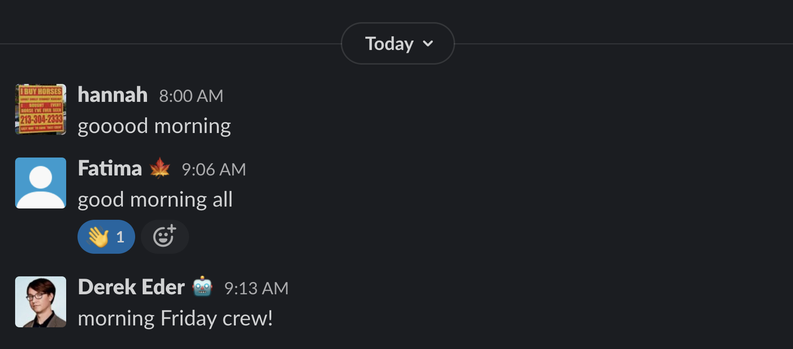

# 🏡 Remote work

DataMade is a fully distributed team, with staff in located in four different
U.S. cities as of Fall 2020. We believe that remote teams function best with a
few ground rules and intentional practices around communication and connection.
This page outlines ours.

## Ground rules

We try to abide by [basic remote etiquette](https://www.yonder.io/post/the-10-commandments-of-remote-work-etiquette).
This really boils down to making the most of times we get together as a team and
with our clients: Set an agenda, show up on time, and ensure your A/V setup
works.

## Communication

### Hi and bye

DataMade uses Slack to stay in touch during the work day. Work schedules vary
across the team. To keep everyone on the same page, say hi and bye when signing
on and off the for the day, as well as at lunch.

### Google Calendar

We increasingly rely on Google Calendar to keep track of meetings, out of office
blocks, and time off – so much so that we begin each day with a ceremonial
reading of events on the calendar.

We individually manage our schedules using the Google Calendar associated with
our `@datamade.us` email address. (Don't forget to [set your working hours](https://support.google.com/calendar/answer/7638168)!)
In turn, these calendars are visible to everyone on the team to consult when
setting meetings, planning work, etc.

When you create calendar events, be sure to [invite attendees](https://support.google.com/calendar/answer/37161)
and specify whether invitations are optional. If you receive a calendar invite,
try to [RSVP ahead of time](https://support.google.com/calendar/answer/37135) so
we have a full picture of time commitments and availability.

Many of us like the handy dandy [Google Calendar Slack extension](https://slack.com/app-pages/google-calendar)
to stay on top of our schedules.

## Connection

### Pair programming

One of the things we miss from the salad days of in-person work is the ease of
rolling over to a coworker's desk to pair on a tricky technical challenge. We
still think that pair programming is an important tool in any developer's
toolkit, so we've endeavored to find relatively seamless ways to pair remotely.

First things first, know that pairing is almost always an available option.
Scenarios where we've found pairing particularly useful include:

- Being stuck on a problem, whether that means you're lost or you're spinning
your wheels
- Being faced with an urgent issue that would benefit from synchronous feedback
- Performing a high risk operation, like database surgery, where you'd
appreciate a second set of eyes

Managers should try to be cognizant of times when they're delegating work that
could put their teammates in any of these positions and proactively offer to
pair if desired.

**Regardless of whether it's explicitly offered, anyone on the team can request
to pair!** We try to make clear who's available by saying hi and bye, keeping
the calendar up to date, and giving a rough shape of our days at our morning
check in. You can use this information to reach out to teammates directly when
they're free or post a broader request in the `#computer-programming` Slack
channel.

In terms of tooling, we've had success with pairing via screenshare [in Slack](https://slack.com/help/articles/115003501303-Share-your-screen-with-Slack-calls)
(which includes the ability to draw on the screen, super helpful for folks who
like to point and gesture 🙃) and [Google Hangouts](https://hangouts.google.com/).

### Team tea time

In the Zoom era, there are tons of ideas for remote team bonding. For our part,
we prefer a minimal approach that folks can dip in and out of as their schedules
allow. Enter **Team tea time**, our optional twice weekly get-together. ☕️

Every week, we schedule two 30-minute slots for available members of the team
to gather via Google Hangout. Sometimes, these tea times have a set topic, e.g.,
discussing an interesting article. (Ideas for tea time topics are generally
shared in the #talks channel in Slack.) Sometimes, we use tea time to commune
with other teams based in Civic Exchange. Most of the time, tea time is just
half an hour to shoot the breeze and consume your preferred beverage and/or
snack in good company.
